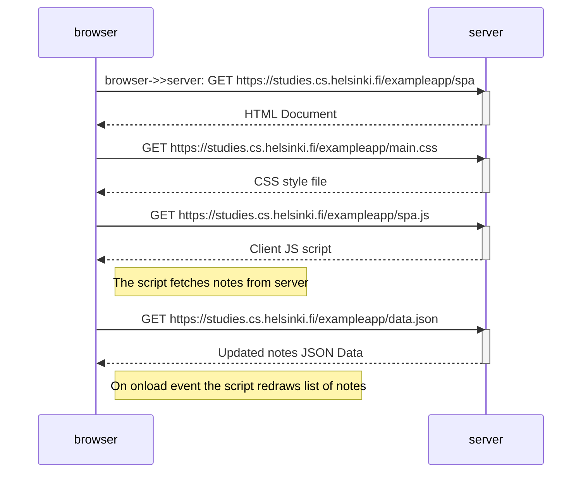

# Single page app diagram

```mermaid
sequenceDiagram
    participant browser
    participant server

    browser->>server: browser->>server: GET https://studies.cs.helsinki.fi/exampleapp/spa
    activate server
    server-->>browser: HTML Document
    deactivate server

    browser->>server: GET https://studies.cs.helsinki.fi/exampleapp/main.css
    activate server
    server-->>browser: CSS style file 
    deactivate server

    browser->>server: GET https://studies.cs.helsinki.fi/exampleapp/spa.js
    activate server
    server-->>browser: Client JS script 
    deactivate server

    note right of browser: The script fetches notes from server

    browser->>server: GET https://studies.cs.helsinki.fi/exampleapp/data.json
    activate server
    server-->>browser: Updated notes JSON Data
    deactivate server

    Note right of browser: On onload event the script redraws list of notes
```
